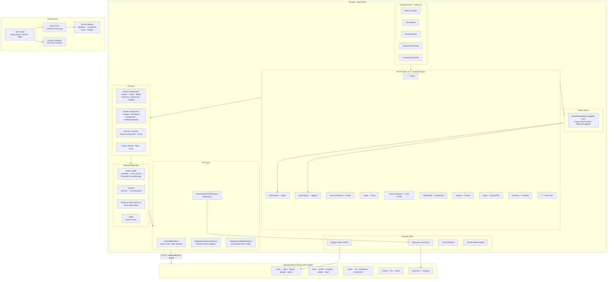
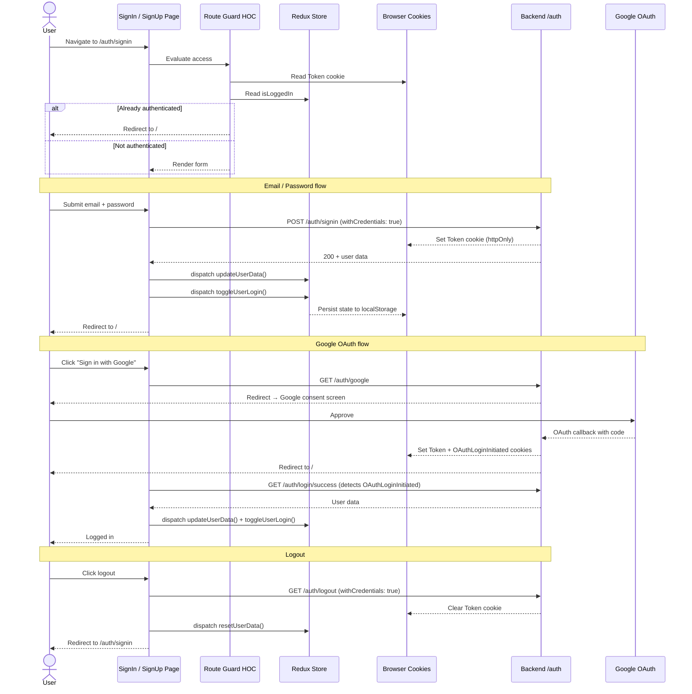
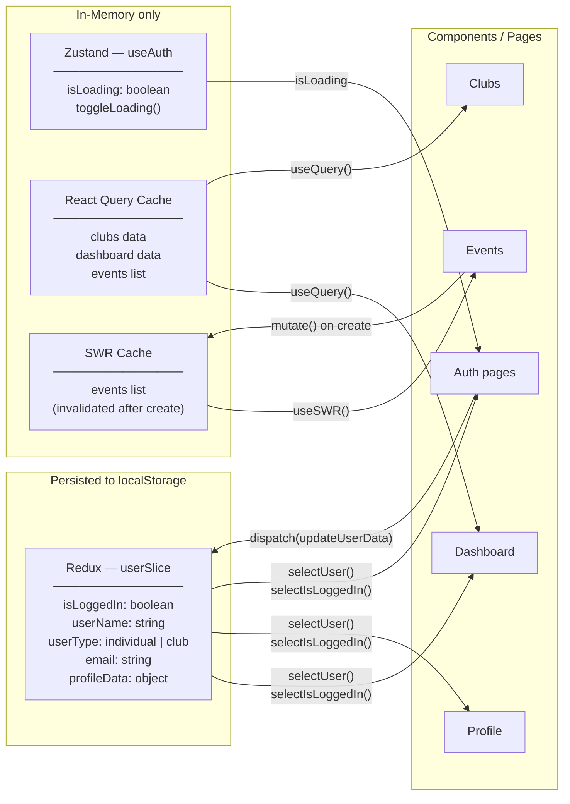
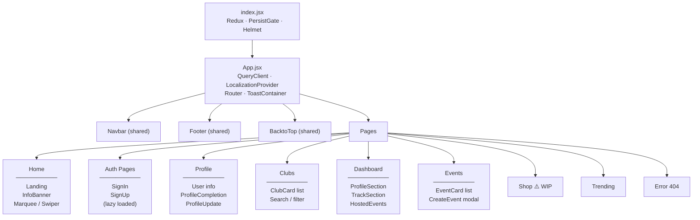
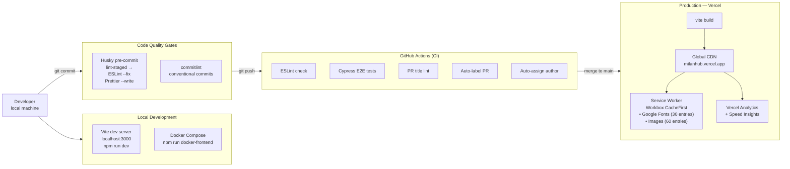

# NGOWorld (Milan) — Architecture Diagrams

---

## 1. High-Level Architecture

---

## 2. Auth Data Flow

---

## 3. State Management Overview

---

## 4. Component Hierarchy

---

## 5. Build & Deployment Pipeline

---

## Technology Stack Summary

| Layer | Technology |
|---|---|
| Framework | React 18 + Vite 4 |
| Routing | React Router v6 |
| Global / Auth State | Redux Toolkit + redux-persist → localStorage |
| UI State | Zustand |
| Server / Cache State | TanStack React Query v5 + SWR |
| UI Components | MUI v5 (Emotion) + styled-components + SCSS |
| Forms & Validation | react-hook-form + Zod |
| HTTP Client | Axios — two layers: `integrations/` (newer) + `service/` (legacy) |
| Authentication | Cookie-based (httpOnly Token) + Google OAuth redirect |
| Payments | Razorpay (`checkout.js`) |
| Animations | Framer Motion + AOS + @studio-freight/lenis |
| PWA | vite-plugin-pwa + Workbox service worker |
| SEO | react-helmet-async |
| Analytics | Vercel Analytics + Speed Insights |
| E2E Testing | Cypress |
| Linting / Formatting | ESLint + Prettier + Husky + commitlint |
| Deployment | Vercel (production) + Docker Compose (local) |
